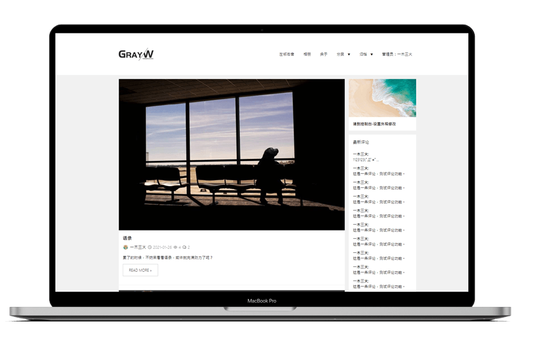

 

## Typecho Theme GrayW 
## Typecho 主题 灰白
## Version：1.1

这个主题是 18年9月 左右的时候制作的，20210520填坑。

### Tips

- [ ] 未来更新？
- [ ] 代码优化？
- [ ] 单独的page
- [ ] 单独的page - 相册
- [ ] 单独的page - 足迹

### Function

**文本功能扩展**
登录可见：`[Forlogin][/Forlogin]`
登录评论可见：`[hide][/hide]`

**字段扩展**
自定义略缩图
是否原创
浏览数

### Updatelog

v1.1 根据已有代码随便改了一些东西
>基本主题
手机端的菜单 PC端的是否要改
主页截断展示方法 一个是识别more  一个是自动识别截断
长字母截断

